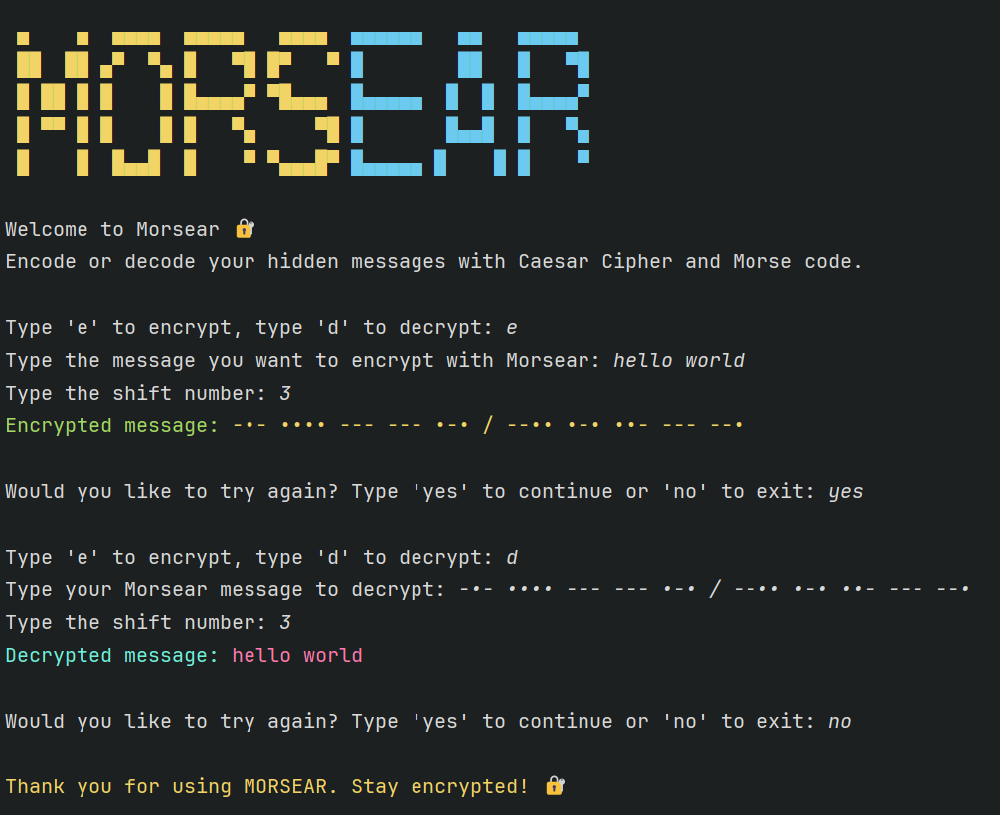

#  🔐 Morsear
**Morsear** is a Python tool that encrypts and decrypts messages using a combination of Caesar cipher and Morse code. This hybrid approach brings a twist to cryptography, making secret communication both secure and effective.

## Preview



## Features

- Encode messages with Caesar shift + Morse code
- Decode encrypted Morsear messages back to readable text
- Interactive command-line interface
- Modular structure for easy updates

## How It Works
Morsear applies a Caesar cipher shift to each character in your message, then converts the result into Morse code. Decryption reverses the process using a reverse Morse dictionary.

## Project Structure
```text
morsear/
├── core/
│   ├── encryptor.py            
│   └── decryptor.py             
├── config/
│   └── morse_caesar_config.py   
├── utils/
│   └── display.py               
├── main.py                      
```

## Supported Characters

Defined in `config/morse_caesar_config.py`, Morsear supports:

- **Alphabets**: A–Z and a–z (case-insensitive; lowercase letters are converted to uppercase before encoding)
- **Numbers**: 0–9
- **Symbols**: `. , ? ' ! / ( ) & : ; = + - _ " $ @`
- **Space**: Represented as `/`
- **Other characters**: Any symbol not in the Morse dictionary is preserved as-is during encryption and decryption
